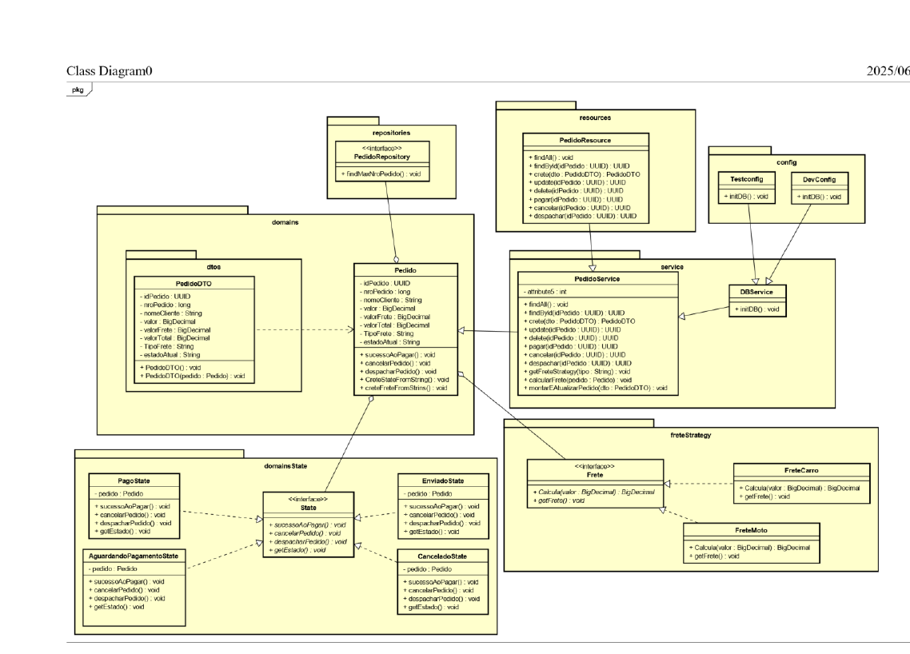

📝 Sistema de Gerenciamento de Pedidos
Sistema desenvolvido em Spring Boot, aplicando os padrões de projeto Strategy e State para gestão de frete e controle do ciclo de vida dos pedidos.

👨‍💻 Desenvolvedor:
Pedro Emmanuel Amaral Martins

🔗 Endpoints e Funcionalidades da API
Criar Pedido:
POST /pedido — Cria um novo pedido.

Atualizar Pedido:
PUT /pedido/{id} — Atualiza um pedido existente.

Excluir Pedido:
DELETE /pedido/{id} — Remove um pedido pelo ID.

Listar Pedidos:
GET /pedido — Retorna todos os pedidos cadastrados.

Buscar Pedido por ID:
GET /pedido/{id} — Retorna os dados de um pedido específico.

Transições de Estado:
PATCH /pedido/{id}/pagar — Define o estado do pedido como "Pago".
PATCH /pedido/{id}/cancelar — Define o estado como "Cancelado".
PATCH /pedido/{id}/despachar — Define o estado como "Despachado".

⚙️ Tecnologias Utilizadas
Java 17
Spring Boot
Banco de Dados H2 (ambiente de testes)
PostgreSQL (ambiente de desenvolvimento)
Padrões de Projeto: Strategy e State

🏗️ Padrões de Projeto Implementados
🔹 Strategy
Responsável pelo cálculo de frete, permitindo a expansão de novas regras de negócio sem impacto no código existente.
Implementações atuais:

FreteAviao
FreteCaminhao

🔸 State
Gerencia os estados do pedido, controlando o fluxo de transições e garantindo regras de negócio consistentes.
Estados implementados:

AguardandoPagamentoState
PagoState
EnviadoState
CanceladoState

Cada estado define quais operações são permitidas, impedindo transições inválidas e mantendo a integridade do ciclo de vida do pedido.

🧪 Testes via Postman
Realize requisições utilizando os métodos: POST, PUT, GET, DELETE e PATCH.

Também é possível importar uma coleção no Postman para facilitar os testes.

🔗 Exemplo de requisição PATCH:
PATCH http://localhost:8080/pedido/{id}/pagar

📜 Regras de Negócio
Um pedido não pode ser pago se já estiver nos estados: PAGO, ENVIADO ou CANCELADO.
Um pedido não pode ser cancelado ou despachado após ser enviado.
O cálculo do frete é automático, determinado pela estratégia de frete selecionada.

📊 Diagrama de Classes
O projeto conta com um diagrama UML detalhando a estrutura das classes e seus relacionamentos.

🎯 Observações Finais
Projeto desenvolvido com foco em aprendizado e aplicação de boas práticas em Engenharia de Software e Desenvolvimento Backend com Java.